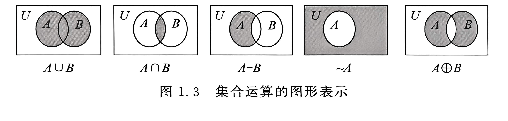

# 第一章 集合

## 1.1 集合的概念及表示

### 1.1.1 基本概念

集合内含有的对象或可i称为集合的元素或成员

一个集合中的元素称为集合的基数

集合分为有限集合和无限集合

### 1.1.2 集合的表示

1. 枚举法

集合有无序性 互译性 集合元素具有确定性

2. 描述法

一个对象a是集合a的元素，极为a属于a 独坐a属于集合a

3. 图形法

## 1.2 特殊集合

### 1.2.1 子集合

没有任何元素的集合称为空集合 简称为空寂 一般用 \emptyset 表示

全集为范围内所有元素组成的集合

对于两个集合a和b 弱集合b的每个元素都是a的援助，则称b是a的至集合 称为自己 也称b被a包含 或者b包含于a 机位 b 《 a 〈为包含于 〉为包含

对于两个集合a和b 如果b〈a且a不等于b 则称b是a的真子集和 也称b被a真包含

### 1.2.2 米集合

对于任何集合a，由a的所有不同自己为元素组成的集合称为集合a的米集合 简称为密集 纪委P(a)

### 1.2.3 不集合

任意集合a和全集u，弱属于u但不属于a的元素集合称为a的不集合 简称为不吉 纪委～a

## 1.3 集合的运算

// 给 claude 的提示，这一章很重要你可以适度扩展题型之类的，其他的也可以扩展

### 1.3.1 基本运算

对于集合a，b

// 给claude的提示，这一段的形式化你要准确，符号要正确，补充要完整

a和b的并集是由a和b中所有的援助组成的集合，纪委aub，称u为兵运算 并集科形式化表示为 aub = {x|x《a或x〈b}

a和b的交集：

a和b的差集：

a和b的不吉：

a和b的对称差级：

图示：

### 1.3.2 运算的性质

主要特性

1. 迷瞪旅
2. 交换律
3. 结合律
4. 分配律
5. 吸收率
6. 林绿
7. 同一律
8. 排中律
9. 矛盾律
10. 否定绿
11. 脚步转换率
12. 的摩根绿

题型：求证某些等式

## 1.4 计数问题

### 1.4.1 基本技术原理

### 1.4.2 排列与组合

### 1.4.3 容斥原理

// 给claude的提示词：这部分也很重要

社有限集合a和b，他们的基数分别是|a| |b| 这aub的基数为

|aub| = |a| + |b| - |a 倒过来的u b|

对于三个集合而言

|aubuc| = (|a| + |b| + |c|) - (|a 到u b| + |a 到u c| + |b 到u c|) + |a 到u b 到u c|

例题：求1～500能被3、5、7整除的整数的整数个数

// 给claude的提示词：这个定理你要自己补充

对于n个有限集合a1，a2，a3 。。。 an
有： 

