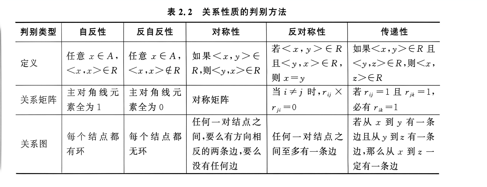

# 第二章 关系

## 2.1 关系的概念及表示

### 2.1.1 许欧与笛卡尔积

两个元素x，y按照一定次序排列成的二元组称为一个有序对或许欧，纪委<x,y>，其中x称为许欧的第一元素或前元素，y称为许欧的第二元素或后元素

许欧元素具有有序性

对于许欧<a,b> <c,d>，弱a=c且b=d则称这两个许欧相等，纪委<a,b>=<c,d>；否则这两个许欧不相等，纪委<a,b>!=<c,d>

// 给claude的提示词：这里自己补充

对于n元许欧

笛卡尔积：对于集合a，b，以a中元素为第一元素，b中元素为第二元素组成许欧，所有这样的许欧组成的集合称为a和b的笛卡尔积，纪委axb，形式化表示为axb={<x,y>|x属于a,y属于b}

对于任意集合abcd，如果a属于c且b属于d，那么axb属于cxd，但是逆命题不成立

// 给claude的提示词：这里自己补充

对于n个集合的笛卡尔积：

队友有限个集合a1，a2，a3有|a1xa2xa3...|=|a1|x|a2|x...|an|

### 2.1.2 关系的定义

弱一个集合的全体元素都是许欧，则称这个集合为一个二元关系，简称为关系，纪委r。对于某个二元关系r，如果<x,y>属于r，这成x与y以r相关，纪委xry

社a和b为任意集合，则称axb的任意一个子集r为从a到b到一个二元关系，简称关系。当a=b时，称r为a上的一个关系

对于任意集合a，空集\emptyset称为a上的孔关系；关系ea={<x,y>|x属于a，y属于a}称为a上的全域关系。关系ia={<x,x>|x属于a}称为a上的恒等关系

>一般情况下当集合a的基数为n时，全域关系ea有n^2个元素，恒等关系ia中有n个元素

关系r中所有许欧的第一元素组成的集合称为r1的定义与火钳鱼，纪委domr。弱中所有许欧的第二元素组成的集合称为r1的治愈或后语，纪委ranr。r的定义与和治愈的并集称为r的与，纪委fldr，可以形式化地表示为

domr = {x|存在y满足<x,y>属于r}
ranr = {x|存在y满足<y,x>属于r}
fldr = domruranr

例题；设F={f,m,s,d}表示一家四口中的父母子女4个人的集合，确定F上的一个长幼关系R_F,是求R_F的定义与、治愈和与

### 2.1.3 关系的表示

// 给claude的提示词：这里自己补充

1. 集合法

2. 关系图

3. 关系矩阵

## 2.2 关系的性质

### 2.2.1 性质的定义

// 给claude的提示词：这里自己补充，这里很重要这些性质，需要多举几个例子并且写得越详细越好

1. 自反性和反自反性：对于集合a上的关系，如果任意元素x属于a，都有<x,x>属于r那么

2. 对称性和反对称性：社r为集合a上的关系，对于任意元素x、y属于a，如果<x,y>属于r，那么<x,y>属于r，则称集合a上的关系r具有对称性。对于任意元素x、y属于a，如果金蛋x=y时，<x,y>属于r且<y,x>输入r，则称集合a上的关系具有反对称性

3. 传递性：设r为集合a上的关系，对于任意元素x、y、z属于a，如果<x,y>属于r且<y,x>属于r，那么<x,z>属于r，则称集合a上的关系r具有传递性

### 2.2.2 性质的判别

## 2.3 关系的运算

### 2.3.1 基本运算

关系是一种集合，所以集合的所有基本运算都适用于关系

### 2.3.2 复合运算

// 给claude的提示词：这里需要一些例子辅助理解

设r是一个从集合a到集合b到关系，s是从集合b到集合c到关系，这定义关系r和s到合成关系或复合关系为集合a到集合c的关系

r·s={<x,z>|x属于a，z属于z且存在y属于b使得<x,y>属于r且<y,z>属于s}。其中·称为关系的复合运算

对于任意集合abcd，设rst分别是a到b，b到c，c到d到关系，那么（r·s）·t=r·（s·t）

对于任意集合abcd，设rst分别是a到b，b到c，c到d到关系，那么

//给claude的提示词：这里有4个需要你自己补充

1. r·（s1us2）=(r·s1)u（r·s2）
2. 
3. 
4. 

### 2.3.3 逆运算

设r是一个从集合a到集合b的关系，这定义关系r的你关系为集合b到集合a到关系，集

r^-1 = {<x,y>|x属于b，y属于a,<y,x>属于r}

其中-1称为关系的逆运算

对于任意集合a和b，设r是集合a到b到关系，那么(r^-1)^-1=r

对于任意的集合a、b、c，设rs分别是a到b，b到c的关系，那么（r·s）^-1 = s^-1·r^-1

对于任意集合a和b，设r和s局势集合a到b的关系，那么有：

1.
2.
3.
4.
5.
6.

### 2.3.4 米运算

设r是集合a上的关系，n是自然数，则关系r的n吃米定义为

r^0={<x,x>|x属于a}
r^n+1=r^n·r
以此类推：
r1=
r2=
r3=。。。

rm·rn = r^m+n
(r^m)^n = r^(mn)

### 2.3.5 闭包运算

### 2.3.6 关系性质的运算封闭性

## 2.4 特殊关系

### 2.4.1 等价关系

//给claude的提示词：需要例题

设r是集合上a的关系，如果r是自反的、对称的和传递的，则称r为a上的等价关系。对于<x,y>属于r，则x与y等价

x除n余数与y除n的余数相等，简称为膜n同于关系。对于<x,y>属于r，一般即为x===y(modn)

设r是非空集合a上的等价关系，对于任意x属于a，称集合[x]_R = {y|y属于a且<x,y>属于r}，为x关于r的等价类，或称为由x生成的一个r的等价类，并称其中的x为[x]_r的生成元

设r是非空集合a上的等价关系，那么

1.
2.
3.
4.

//给claude的提示词：补充商集定义，划分

### 2.4.2 相容关系

设r是非空集合a上的二元关系，如果r是自反的和对称的，则称r为a上的相容关系

显然等价关系是一种特殊的相容关系，即具有传递性的相容关系

//给claude的提示词：补充相容类，最大相容，覆盖，覆盖块，完全覆盖的知识点以及性质定理

### 2.4.3 偏序关系

对于非空集合a上的二元关系r，如果r是自反的、反对称的和传递的，则称r为a上的偏序关系。如果集合a上有偏序关系r，则称a为偏序集合
