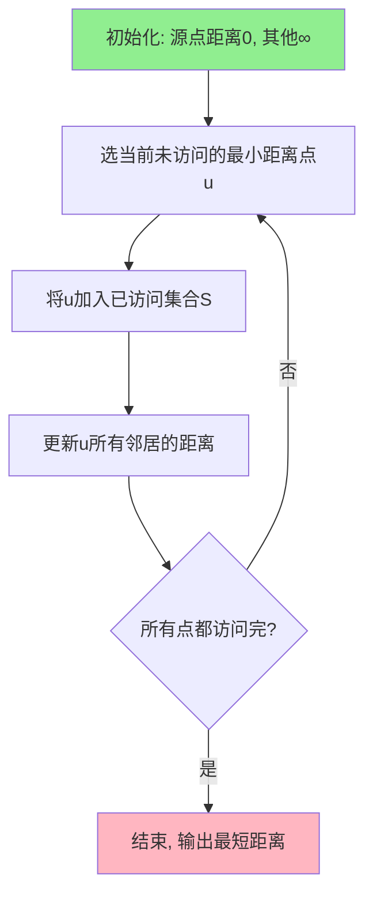
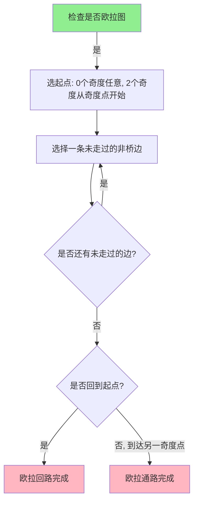

# 第四章 图

## 4.1 图的概念与表示

### 4.1.1 基本概念

由结点集合 $V = \{v_1, v_2, \ldots, v_n\}$ 和连接结点的边集合 $E = \{e_1, e_2, \ldots, e_m\}$ 组成的二元组 $G = \langle V, E \rangle$ 称为**图**。图中结点集合的基数 $n$ 称为图的**阶**。图 $G$ 称为 $n$ 阶图或 $(n, m)$ 图。

两个元素 $x$ 和 $y$ 无序排列成的二元组称为一个**无序对**或**无序偶**，记作 $(x, y)$。

**有向边与无向边**：

- 从结点 $u$ 到结点 $v$ 的有方向的边称为**有向边**，用序偶 $\langle u, v \rangle$ 表示，其中 $u$ 称为有向边的**始点**，结点 $v$ 称为有向边的**终点**，结点 $u$ 和 $v$ 称为有向边的**端点**。
- 连接结点 $u$ 和结点 $v$ 的无方向的边称为**无向边**，用无序偶 $(u, v)$ 表示，其中结点 $u$ 和 $v$ 称为无向边的**端点**。
- 以结点 $u$ 为端点的边称为结点 $u$ 的**关联边**。

**特殊边**：

- 连接结点 $u$ 到结点 $u$ 的边，称为结点 $u$ 的**自环**（或环）。
- **平行边**（多重边）：两个端点之间多于一条的边。
- **重数**：两个端点之间平行边的条数。

**图的分类**：

- 含有平行边的图称为**多重图**。
- 既不含平行边又不含有自环的图称为**简单图**。
- 所有边都是无向边的图称为**无向图**。
- 所有边都是无向边的简单图称为**无向简单图**。
- 所有边都是有向边的图称为**有向图**。
- 所有边都是有向边的简单图称为**有向简单图**。
- 既有有向边又有无向边的图称为**混合图**。

**完全图**：

- 对于 $n$ 个结点的无向简单图 $G = \langle V, E \rangle$，如果任意两个结点之间都有边相连，则称 $G$ 为**无向完全图**，简称**完全图**，记作 $K_n$。
- 对于具有 $n$ 个结点的有向简单图 $G = \langle V, E \rangle$，如果任意两个结点之间都有两条方向相反的有向边相连，则称 $G$ 为**有向完全图**。

> 完全图 $K_n$ 的边数为 $\dfrac{n(n-1)}{2}$。

**子图**：

设 $G = \langle V, E \rangle$ 是一个图，$G_1 = \langle V_1, E_1 \rangle$ 是另一个图。

| 关系 | 名称 | 记号 |
|------|------|------|
| $V_1 \subseteq V$ 且 $E_1 \subseteq E$ | **子图** | $G_1 \subseteq G$ |
| $V_1 \subsetneq V$ 或 $E_1 \subsetneq E$ | **真子图** | $G_1 \subsetneq G$ |
| $V_1 = V$ 且 $E_1 \subseteq E$ | **生成子图**（支撑子图） | — |
| $V_1 \subseteq V$ 且 $E_1$ 包含所有 $V_1$ 内部在 $G$ 中的边 | **导出子图**（诱导子图） | $G[V_1]$ |

> 导出子图：结点集取 $V_1$，边集取原图中所有端点都在 $V_1$ 中的边。

**结点的度**：

在图 $G = \langle V, E \rangle$ 中，以结点 $v \in V$ 为端点的边的条数称为结点 $v$ 的**度数**，简称为**度**，记作 $\deg(v)$。

- **出度**：从结点 $v$ 出发的有向边条数，记作 $\deg^+(v)$。
- **入度**：指向结点 $v$ 的有向边条数，记作 $\deg^-(v)$。
- $\deg(v) = \deg^+(v) + \deg^-(v)$（有向图中）

**悬挂结点与悬挂边**：

- **悬挂结点**：度数为 1 的结点。
- **悬挂边**：与悬挂结点关联的边。

**握手定理**：

在图 $G = \langle V, E \rangle$ 中，结点度数的总和等于边数目的 2 倍：
$$\sum_{v \in V} \deg(v) = 2 \cdot |E|$$

**推论 1**：任意图中度数为奇数的结点个数为**偶数**。

**推论 2**：在有向图 $G = \langle V, E \rangle$ 中，结点的出度总和等于入度总和，等于边数：
$$\sum_{v \in V} \deg^+(v) = \sum_{v \in V} \deg^-(v) = |E|$$

**同构的简单判断**：

1. 结点数目相同
2. 边数相同
3. 度数相同的结点数目相同

### 4.1.2 图的连通性

**通路（路径）**：

在无向图 $G = \langle V, E \rangle$ 中，结点和边的交替序列 $v_{i_0}, e_{j_1}, v_{i_1}, e_{j_2}, v_{i_2}, \ldots, e_{j_p}, v_{i_p}$ 称为结点 $v_{i_0}$ 到 $v_{i_p}$ 的**通路**（或路径），简记为 $v_{i_0} v_{i_1} \ldots v_{i_p}$。有向图同理。

**通路的长度**：一条通路中所含边的总数。

**通路的分类**：

- **简单通路**（迹）：不含有相同边的通路。
- **初级通路**（基本通路）：不含有相同结点的通路。
- 初级通路一定是简单通路，反之不一定。

**回路（环路）**：

在图 $G = \langle V, E \rangle$ 中，结点 $u$ 到 $v$ 的通路满足 $u = v$，则称该通路为经过结点 $u$ 的**回路**。

- **简单回路**：不含有相同边的回路。
- **基本回路**（初级回路）：除结点 $u$ 和 $v$ 外，不含有相同结点的回路。

**可达与连通**：

在图 $G = \langle V, E \rangle$ 中，如果存在结点 $u$ 到 $v$ 的通路，则称结点 $u$ 到结点 $v$ 是**可达的**，或者结点 $v$ 是结点 $u$ 的可达点，或者结点 $u$ 和结点 $v$ 是**连通的**。

在无向图 $G = \langle V, E \rangle$ 中，如果任意两个结点都是连通的，则称 $G = \langle V, E \rangle$ 是**连通图**，或者 $G$ 是**连通**的。

**连通分支（连通分量）**：

在无向图 $G = \langle V, E \rangle$ 中，结点之间的可达关系 $R$ 的每个等价类导出的子图都称为图 $G$ 的一个**连通分支**。

不同的连通分支的个数称为图 $G$ 的**连通分支数**，记作 $p(G)$。

**连通性的特殊情况**（有向图，不考理论，了解即可）：

- **强连通**：有向图中，任意两个结点 $u, v$ 互相可达。
- **弱连通**：将有向边视为无向边后图是连通的。
- **单连通**：有向图中，任意两个结点至少有一个方向可达。

> 期末考试只考**无向图**的连通性。

### 4.1.3 图的操作

期末不考。

### 4.1.4 图的表示

期末不考（关联矩阵、邻接矩阵等存储方式不考）。

## 4.2 赋权图

### 4.2.1 赋权图的定义

**赋权图**（带权图）：每条边都赋有一个实数（权值）的图，记作 $G = \langle V, E, W \rangle$，其中 $W$ 是边到实数的映射。

**表示方式**：
- 在边上直接标注权值
- 用列表列出每条边和权值

### 4.2.2 最短通路问题

求从一个源点到其他各点的最短路径（路径上权值之和最小）。

#### Dijkstra 算法

**用途**：求单源最短路径（从一个结点到其他所有结点的最短距离）。

**输入**：带权无向图 / 有向图，权值非负。

**输出**：源点到各点的最短距离及最短路径。

**算法步骤**：

设源点为 $v_0$，结点集 $V$，已求最短路径的结点集为 $S$（初始为 $\{v_0\}$），$T = V - S$。

1. **初始化**：
   - $d(v_0, v_0) = 0$
   - $d(v_0, v_i) = w(v_0, v_i)$（$v_i$ 与 $v_0$ 直接相连的权值）
   - $d(v_0, v_i) = \infty$（$v_i$ 与 $v_0$ 不直接相连）

2. **循环**（$|V| - 1$ 次）：
   - 从 $T$ 中选取当前距离最小的结点 $u$
   - 将 $u$ 加入 $S$
   - 对 $T$ 中每个结点 $v$，更新距离：
     $$d(v_0, v) = \min(d(v_0, v), d(v_0, u) + w(u, v))$$

3. **结束**：所有结点加入 $S$ 时，$d(v_0, v)$ 就是源点到 $v$ 的最短距离。

**算法流程图**：



**例题**：

求下图中 $A$ 到其他结点的最短路径。

| 边 | 权值 |
|------|:---:|
| $A-B$ | 4 |
| $A-C$ | 2 |
| $B-C$ | 1 |
| $B-D$ | 5 |
| $C-D$ | 8 |
| $C-E$ | 10 |
| $D-E$ | 2 |
| $D-F$ | 6 |
| $E-F$ | 3 |

**求解过程**：

| 步骤 | 已选 $S$ | 距离表 $(A:B,A:C,\ldots)$ | 选最小 |
|:---:|---------|--------------------------|-------|
| 初始 | $\{A\}$ | $A:0, B:4, C:2, D:\infty, E:\infty, F:\infty$ | $C:2$ |
| 1 | $\{A,C\}$ | $A:0, B:3, C:2, D:10, E:12, F:\infty$ | $B:3$ |
| 2 | $\{A,C,B\}$ | $A:0, B:3, C:2, D:8, E:12, F:\infty$ | $D:8$ |
| 3 | $\{A,C,B,D\}$ | $A:0, B:3, C:2, D:8, E:10, F:14$ | $E:10$ |
| 4 | $\{A,C,B,D,E\}$ | $A:0, B:3, C:2, D:8, E:10, F:13$ | $F:13$ |

**结果**：
- $A \to B$：最短 3
- $A \to C$：最短 2
- $A \to D$：最短 8
- $A \to E$：最短 10
- $A \to F$：最短 13

## 4.3 欧拉图

### 4.3.1 欧拉图的定义

**欧拉通路**：经过图中**每条边恰好一次**的通路。

**欧拉回路**：经过图中**每条边恰好一次**的回路。

**欧拉图**：具有欧拉回路的图。

**半欧拉图**：具有欧拉通路但不具有欧拉回路的图。

> 规定：平凡图（一个点）也是欧拉图。

### 4.3.2 欧拉图的判定

**无向欧拉图的判定**：

> 无向图 $G = \langle V, E \rangle$ 含有欧拉通路，当且仅当 $G$ 是连通图且有**零个或两个奇度**结点。

- 0 个奇度结点 → **欧拉回路**（起点 = 终点）
- 2 个奇度结点 → **欧拉通路**（起点和终点为这两个奇度结点）

**推论 1**：无向图 $G = \langle V, E \rangle$ 含有欧拉回路，当且仅当 $G$ 是连通图且**所有结点**的度数都是偶数。

**有向欧拉图的判定**：

> 有向图 $G = \langle V, E \rangle$ 含有欧拉通路，当且仅当 $G$ 是连通的，且除了两个结点外，其余结点的入度等于出度，而这两个结点中一个结点的入度比出度大 1，另一个结点的入度比出度小 1。

**推论**：有向图 $G = \langle V, E \rangle$ 含有欧拉回路，当且仅当 $G$ 是连通的，且**所有结点**的入度等于出度。

#### Fleury 算法

**用途**：求欧拉回路 / 欧拉通路。

**前提**：图必须是欧拉图或半欧拉图。

**算法步骤**：

1. **判断**：检查图是否连通、奇度结点个数（0 或 2）。
2. **起点选择**：
   - 0 个奇度结点 → 任意结点作起点
   - 2 个奇度结点 → 以其中一个奇度结点作起点
3. **构造回路**：
   - 从起点出发
   - 每步选择一条**未走过的边**
   - **优先选择"非桥"的边**（删除后仍使图连通的边）
   - 除非没有其他选择，否则不走桥
4. **结束**：走完所有边，回到起点（欧拉回路）或到达另一个奇度结点（欧拉通路）。

**算法流程图**：



**例题**：

下图是一个欧拉图，求一条欧拉回路。

```
    A --- B
    |   / |
    |  /  |
    C --- D
```

各结点度数：A(2), B(3), C(3), D(2)。奇度结点为 B 和 C。

**解**：

从 B 出发（B 是奇度点之一）。

走非桥边的顺序：B → A → C → D → B → C → D（其中 B-D 是桥）→ B

**结果**：B → A → C → D → B → C → D → B

## 4.4 哈密顿图

### 4.4.1 哈密顿图的定义

**哈密顿通路**：经过图中**每个结点恰好一次**的通路。

**哈密顿回路**：经过图中**每个结点恰好一次**的回路。

**哈密顿图**：具有哈密顿回路的图。

**半哈密顿图**：具有哈密顿通路但不具有哈密顿回路的图。

> 与欧拉图的区别：
> - 欧拉图：每条**边**恰好走一次
> - 哈密顿图：每个**结点**恰好走一次

### 4.4.2 哈密顿图的判定

**必要条件**：

> 设无向图 $G = \langle V, E \rangle$ 是哈密顿图，则对结点集 $V$ 的任意非空子集 $V_1$，都有 $p(G - V_1) \leq |V_1|$。

其中 $p(G - V_1)$ 是从图中删除 $V_1$ 后剩下的连通分支数。

**推论**：设无向图 $G = \langle V, E \rangle$ 中含有哈密顿通路，则对结点集 $V$ 的任意非空子集 $V_1$，都有 $p(G - V_1) \leq |V_1| + 1$。

**充分条件**（Dirac 定理）：

> 设 $G = \langle V, E \rangle$ 是 $n$（$n \geq 3$）阶无向简单图，如果 $G$ 中任意两个不相邻结点的度数之和都大于等于 $n$，则 $G$ 中存在哈密顿回路。

**哈密顿回路的查找方法**（应用题做法）：

哈密顿图没有简单的算法，一般采用**试探法**：

1. 选定一个起点
2. 从起点出发，每次选择未访问的相邻结点
3. 如果走不下去（所有邻居都访问过），就**回溯**到上一步换条路
4. 直到所有结点都访问过，且能回到起点

**例题**（排课问题）：

7 门课需要在 7 个时间段安排。已知老师约束：
- 张老师：不能同时上"高数"和"线代"
- 李老师：不能同时上"线代"和"离散"
- 王老师：不能同时上"高数"和"离散"
- ...

**做法**：

1. 把 7 门课当作 7 个结点
2. 把"不能同时上"的课连边
3. 找一条**哈密顿回路** → 排课方案

```
    结点：{高数, 线代, 离散, 英语, 物理, 化学, 生物}
    边：(高数, 线代), (线代, 离散), (高数, 离散), ...
```

找到哈密顿回路：高数 → 线代 → 离散 → 英语 → 物理 → 化学 → 生物 → 高数

这就是排课方案。