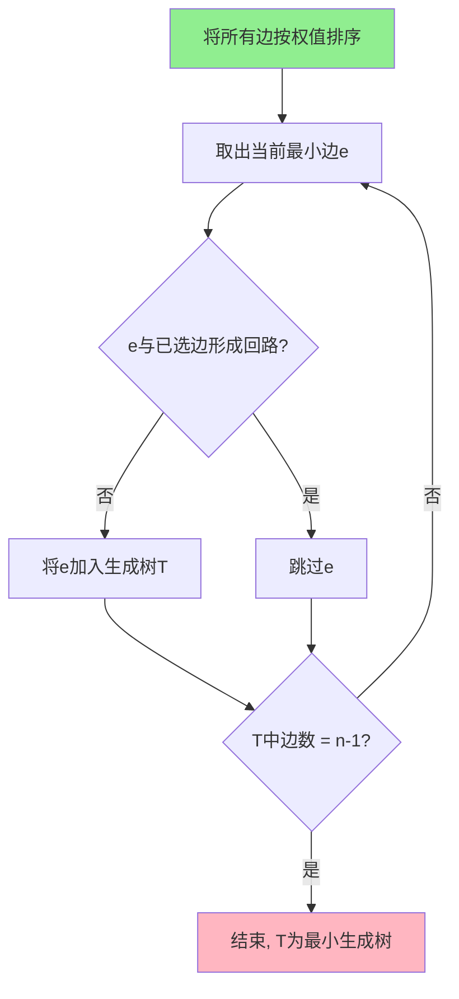
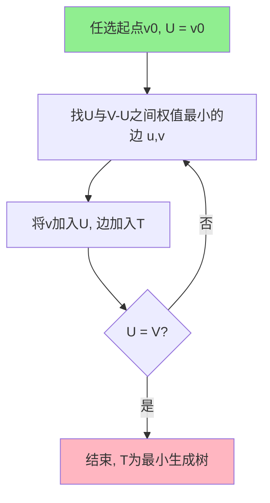
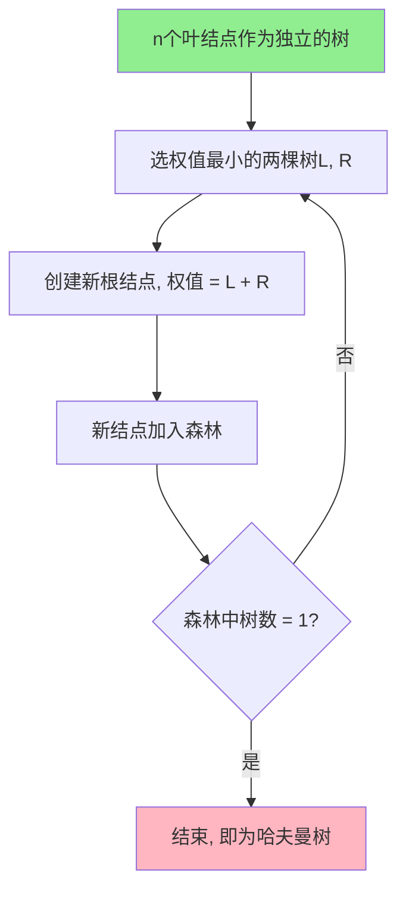

# 第五章 树

## 5.1 无向树

### 5.1.1 基本概念

**无向树**（简称**树**）：连通且不含回路的无向图，常用 $T$ 表示。

**森林**：每个连通分支都是树的无向图。

**相关术语**：

- **叶结点**（叶）：树中度数为 1 的结点。
- **内部结点**（分支结点）：度数大于 1 的结点。
- **分支点**：内部结点的别称。

**树的等价定义**：

设 $T = \langle V, E \rangle$ 是 $n$ 阶无向图，$|V| = n$，$|E| = m$。以下命题等价：

- **性质 1**：$T$ 中无回路且 $m = n - 1$
- **性质 2**：$T$ 是连通图且 $m = n - 1$
- **性质 3**：$T$ 中无回路，但 $T$ 中任何不相邻结点之间增加一条边，就得到唯一的一条基本回路
- **性质 4**：$T$ 是连通图，但去掉任何一条边后，得到的图不连通

> **记忆口诀**：树 = 连通 + 无回路 + 边数 = 顶点数 - 1

**树的叶结点性质**：

> 设 $T = \langle V, E \rangle$ 为 $n$（$n \geq 2$）阶树，则 $T$ 至少有 2 个叶结点。

**赋权树**：

**权函数**：对树的每条边赋予一个非负实数（权值），即从边集 $E$ 到非负实数集的映射 $W: E \to \mathbb{R}_{\geq 0}$。

**权**：赋权树中所有边的权值之和，记作 $W(T)$：
$$W(T) = \sum_{e \in E} W(e)$$

**权值**：单条边上的数值。

### 5.1.2 生成树

**生成树**（支撑树）：设 $G = \langle V, E \rangle$ 是无向连通图，$T = \langle V, E' \rangle$ 是 $G$ 的子图，如果 $T$ 是树，则称 $T$ 是 $G$ 的**生成树**。

**树枝**：生成树 $T$ 中的边。

**余树**（余枝）：$G$ 中除去 $T$ 的边后剩余的边，即 $E - E'$ 中的边。

**存在性定理**：

> 任何无向连通图都存在生成树。

**边数关系**：

- 设无向连通图 $G$ 有 $n$ 个结点 $m$ 条边，则 $m \geq n - 1$。
- 设无向连通图 $G$ 有 $n$ 个结点 $m$ 条边，$T$ 是 $G$ 的生成树，$T^*$ 是 $T$ 的余树，则 $T^*$ 中有 $m - n + 1$ 条边。

**最小生成树问题**：

**最小生成树**（Minimum Spanning Tree, MST）：在一个带权连通无向图中，所有生成树中权值之和最小的那棵树。

> 最小生成树不唯一，但最小权值唯一。

**求最小生成树的两种基本方法**：

| 方法 | 别名 | 思想 |
|------|------|------|
| **避圈法** | Kruskal 算法 | 每次选最小权值的边，**避免形成回路** |
| **破圈法** | — | 每次删除回路中权值最大的边 |

#### Kruskal 算法（避圈法）

**用途**：求连通无向图的最小生成树。

**核心思想**：每次从剩余边中选取权值**最小**的边，若该边不与已选边形成回路，则加入；否则跳过。直到选够 $n - 1$ 条边。

**算法步骤**：

1. **初始化**：将所有边按权值从小到大排序，生成树边集 $T = \emptyset$
2. **循环**（直到 $T$ 包含 $n - 1$ 条边）：
   - 取出当前权值最小的边 $e$
   - 若 $e$ 与 $T$ 中的边**不形成回路**，则将 $e$ 加入 $T$
   - 否则**跳过** $e$
3. **结束**：$T$ 即为最小生成树

**算法流程图**：



**例题**：

求下图的最小生成树（用 Kruskal）。

| 边 | 权值 |
|------|:---:|
| $A-B$ | 1 |
| $A-C$ | 3 |
| $A-D$ | 4 |
| $B-C$ | 2 |
| $B-E$ | 5 |
| $C-D$ | 6 |
| $C-E$ | 7 |
| $D-E$ | 8 |

**求解过程**：

| 步骤 | 候选边 | 选取边 | 是否形成回路 | 操作 |
|:---:|------|--------|:---:|------|
| 1 | A-B(1) | A-B | 否 | 加入 |
| 2 | B-C(2) | B-C | 否 | 加入 |
| 3 | A-C(3) | A-C | 是（已有 A-B-C）| 跳过 |
| 4 | A-D(4) | A-D | 否 | 加入 |
| 5 | B-E(5) | B-E | 否 | 加入（达到 4 条边 = n-1）|

**最小生成树**：

```
    A ---1--- B
    |         |  \
    3         2   5
    |         |    \
    C         E
    |
    4
    |
    D
```

**总权值** = 1 + 2 + 4 + 5 = **12**

#### Prim 算法

**用途**：求连通无向图的最小生成树。

**核心思想**：从一个起点出发，每次从"已选结点集"与"未选结点集"之间选取权值**最小**的边，将对应未选结点加入。直到所有结点加入。

**算法步骤**：

1. **初始化**：
   - 任选一个起点 $v_0$
   - 已选结点集 $U = \{v_0\}$
   - 生成树边集 $T = \emptyset$
2. **循环**（直到 $U = V$）：
   - 从连接 $U$ 与 $V - U$ 的所有边中，选取权值**最小**的边 $(u, v)$
   - 将 $v$ 加入 $U$
   - 将 $(u, v)$ 加入 $T$
3. **结束**：$T$ 即为最小生成树

**算法流程图**：



**例题**：

用 Prim 算法求上图的最小生成树（起点选 A）。

**求解过程**：

| 步骤 | $U$ | 候选边（$U$ 到 $V-U$） | 选最小 | 操作 |
|:---:|-----|---------------------|-------|------|
| 1 | $\{A\}$ | A-B(1), A-C(3), A-D(4) | A-B(1) | B 入 U |
| 2 | $\{A,B\}$ | A-C(3), A-D(4), B-C(2), B-E(5) | B-C(2) | C 入 U |
| 3 | $\{A,B,C\}$ | A-D(4), C-D(6), B-E(5), C-E(7) | A-D(4) | D 入 U |
| 4 | $\{A,B,C,D\}$ | B-E(5), C-E(7), D-E(8) | B-E(5) | E 入 U |

**最小生成树**：（同上）

**总权值** = 1 + 2 + 4 + 5 = **12**

#### Kruskal vs Prim 对比

| 维度 | Kruskal | Prim |
|------|---------|------|
| **核心思想** | 选最小边，避开回路 | 从起点扩展，最小连通代价 |
| **起点** | 无需指定 | 必须指定起点 |
| **边数变化** | 每次 1 条 | 每次 1 条 |
| **时间复杂度** | $O(E \log E)$ | $O(V^2)$ |
| **适合** | 稀疏图 | 稠密图 |

## 5.2 哈夫曼树

### 5.2.1 基本概念

**二叉树**：每个结点最多有两个子树的树结构。

- **根结点**：没有父结点的结点。
- **叶结点**：没有子结点的结点。
- **分支结点**：有子结点的结点。
- **左子树** / **右子树**：根的左 / 右子结点作为根的子树。

**结点的路径长度**：从根结点到该结点的路径上的边数。

**树的路径长度**：从根结点到所有结点的路径长度之和。

**结点的带权路径长度**：从根结点到该结点的路径长度 $\times$ 该结点的权值。

**树的带权路径长度（WPL）**：所有叶结点的带权路径长度之和：
$$WPL = \sum_{i=1}^{n} w_i \cdot l_i$$

其中 $w_i$ 是第 $i$ 个叶结点的权值，$l_i$ 是该叶结点到根的路径长度。

### 5.2.2 哈夫曼树的定义

**哈夫曼树**（最优二叉树）：给定 $n$ 个带权的叶结点，构造出的**带权路径长度（WPL）最小**的二叉树。

**哈夫曼编码**：利用哈夫曼树得到的一种变长编码。频率（权值）越大的字符编码越短，频率越小的字符编码越长。

### 5.2.3 哈夫曼树的构造

**算法步骤**：

1. **初始化**：给定 $n$ 个带权的叶结点 $\{w_1, w_2, \ldots, w_n\}$，每个叶结点作为一个独立的二叉树（只有根结点）。
2. **循环**（$n - 1$ 次）：
   - 从当前森林中选取**权值最小**的两棵二叉树作为左右子树
   - 创建一个新的根结点，权值为两棵子树根结点权值之和
   - 将新结点加入森林
3. **结束**：森林中只剩一棵树，即为哈夫曼树。

**算法流程图**：



**例题 1**：

给定权值 $\{1, 2, 3, 4\}$，构造哈夫曼树。

**求解过程**：

```
初始森林：  1    2    3    4
           (1)  (2)  (3)  (4)
```

**第 1 步**：选最小两个 1 和 2，合并为新结点 3。

```
       3
      / \
     1   2      3     4
    (1) (2)    (3)   (4)
```

> 森林更新为：{3（新）, 3, 4}

**第 2 步**：选最小两个 3（新）和 3，合并为新结点 6。

```
         6
        / \
       3   3         4
      / \  (3)      (4)
     1   2
    (1) (2)
```

> 森林更新为：{6（新）, 4}

**第 3 步**：选 4 和 6，合并为新结点 10。

```
              10
             /  \
            6    4
           / \   |
          3   3  4
         / \  |
        1   2 3
```

**哈夫曼树**：

```
         (10)
        /    \
      (6)    (4)
      / \     |
    (3) (3)  (4)
    / \
  (1) (2)
```

**WPL 计算**：

| 叶结点 | 权值 $w_i$ | 路径长度 $l_i$ | $w_i \times l_i$ |
|:---:|:---:|:---:|:---:|
| 1 | 1 | 3 | 3 |
| 2 | 2 | 3 | 6 |
| 3 | 3 | 2 | 6 |
| 4 | 4 | 1 | 4 |

$WPL = 3 + 6 + 6 + 4 = 19$

**例题 2**：

给定权值 $\{5, 10, 15, 20, 25\}$，构造哈夫曼树。

**求解过程**：

| 步骤 | 森林 | 选最小两个 | 合并为 |
|:---:|------|----------|-------|
| 1 | 5, 10, 15, 20, 25 | 5, 10 | 15 |
| 2 | 15(新), 15, 20, 25 | 15(新), 15 | 30 |
| 3 | 30(新), 20, 25 | 20, 25 | 45 |
| 4 | 30, 45 | 30, 45 | 75 |

**哈夫曼树**：

```
              (75)
             /    \
          (30)    (45)
          / \     /  \
       (15) (15)(20)(25)
        / \
      (5) (10)
```

**WPL 计算**：

| 叶结点 | 权值 $w_i$ | 路径长度 $l_i$ | $w_i \times l_i$ |
|:---:|:---:|:---:|:---:|
| 5 | 5 | 3 | 15 |
| 10 | 10 | 3 | 30 |
| 15 | 15 | 2 | 30 |
| 20 | 20 | 2 | 40 |
| 25 | 25 | 2 | 50 |

$WPL = 15 + 30 + 30 + 40 + 50 = 165$

### 5.2.4 哈夫曼编码

根据哈夫曼树，规定左子树为 0，右子树为 1，从根到叶子的路径就是该字符的哈夫曼编码。

**特点**：
- **前缀码**：任一字符的编码都不是其他字符编码的前缀
- **频率高的字符编码短**
- **频率低的字符编码长**

**例题 3**（接例题 1）：

字符权值 $\{1, 2, 3, 4\}$，哈夫曼树如上，求每个字符的哈夫曼编码。

| 字符 | 权值 | 哈夫曼编码 |
|:---:|:---:|:---:|
| 1 | 1 | 000 |
| 2 | 2 | 001 |
| 3 | 3 | 01 |
| 4 | 4 | 1 |

### 5.2.5 哈夫曼树的重要性质

1. **WPL 最小**：哈夫曼树的带权路径长度在所有可能的二叉树中最小。
2. **叶结点个数固定**：$n$ 个权值对应 $n$ 个叶结点。
3. **结点数**：哈夫曼树共有 $2n - 1$ 个结点（$n$ 个叶结点 + $n - 1$ 个分支结点）。
4. **权值越大的叶结点越靠近根**：构造时反复选最小，可能影响最终结构，但最小权值必然是叶结点中路径最长的。
5. **哈夫曼树不唯一**：当两棵子树权值相等时，位置可以互换，但 WPL 唯一。
6. **没有度为 1 的结点**：哈夫曼树只有叶结点（度为 0）和度为 2 的分支结点。

## 5.3 树的遍历（补充）

> 期末不考，仅作知识补充。

**前序遍历**：根 → 左 → 右

**中序遍历**：左 → 根 → 右

**后序遍历**：左 → 右 → 根

**层序遍历**：按层从上到下、从左到右

## 期末重点速查

| 考点 | 对应章节 | 重要程度 |
|------|----------|:---:|
| 树的定义与性质 | 5.1.1 | ⭐⭐ |
| 生成树、树枝、余树 | 5.1.2 | ⭐⭐ |
| **Kruskal 算法** | 5.1.2 | 🔴 必考 |
| **Prim 算法** | 5.1.2 | 🔴 必考 |
| **哈夫曼树构造** | 5.2.3 | 🔴 必考 |
| **WPL 计算** | 5.2.1 | 🔴 必考 |
| 哈夫曼编码 | 5.2.4 | 🟠 重要 |