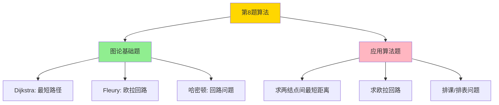

# 图论三大算法对比（第 8 题）

> **第 8 题三选一**：Dijkstra / Fleury / 哈密顿

## 速查表

| 算法 | 用途 | 输入 | 输出 | 关键步骤 |
|------|------|------|------|----------|
| **Dijkstra** | 单源最短路径 | 带权无向图 | 各点到源点的最短距离 | 选最小距离点 → 更新邻居 |
| **Fleury** | 欧拉回路/通路 | 欧拉图 | 走遍所有边的路径 | 优先走非桥的边 |
| **哈密顿** | 哈密顿回路 | 无向图 | 经过每个结点一次的回路 | 试探法 + 回溯 |

## 算法流程对比

## Dijkstra 算法详解

**核心**：贪心 + 动态规划

**步骤**：
1. 初始化：源点距离 = 0，其他 = $\infty$
2. 选未访问的最小距离点 $u$
3. 将 $u$ 加入已访问集合
4. 更新 $u$ 所有邻居的距离
5. 重复 2-4 直到所有点访问

**关键公式**：
$$d(v) = \min(d(v), d(u) + w(u,v))$$

## Fleury 算法详解

**前提**：图连通 + 0 个或 2 个奇度结点

**步骤**：
1. 0 个奇度 → 任意点起步；2 个奇度 → 从奇度点起步
2. 每步优先选**非桥**的边
3. 直到走完所有边

**关键概念**：
- **桥**：删除后使图不连通的边

## 哈密顿算法详解

**判断**：没有充分必要条件，只能试探

**步骤**（试探 + 回溯）：
1. 选起点
2. 每次选未访问的相邻结点
3. 走不下去时**回溯**换路
4. 直到所有结点都访问

**应用**：排课、安排问题

## 期末考法

> 看到"**最短**"、"**距离**" → Dijkstra  
> 看到"**每条边走一次**"、"**欧拉**" → Fleury  
> 看到"**每个结点一次**"、"**排课**"、"**回路**" → 哈密顿

## 关键区别

| 维度 | 欧拉（Fleury）| 哈密顿 |
|------|------------|--------|
| 强调对象 | **边**（每条恰好走一次）| **结点**（每个恰好走一次）|
| 判定 | 有判定条件 | 没有判定条件 |
| 解法 | 算法 | 试探 |

## 来源

- [[wiki/来源/2026-07-01 图]]
- [[wiki/概念/真值表方法]]
- [[wiki/概念/最小生成树]]
- [[wiki/概念/哈夫曼树]]
