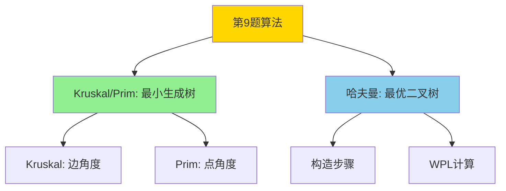

# 树论三大算法对比（第 9 题）

> **第 9 题三选一**：Kruskal / Prim / 哈夫曼

## 速查表

| 算法 | 用途 | 输入 | 输出 | 关键步骤 |
|------|------|------|------|----------|
| **Kruskal** | 最小生成树 | 带权连通图 | 权值最小的生成树 | 选最小边 → 避圈 |
| **Prim** | 最小生成树 | 带权连通图 | 权值最小的生成树 | 选连接已选/未选的最小边 |
| **哈夫曼** | 最优二叉树 | $n$ 个权值 | WPL 最小的二叉树 | 选两棵最小树合并 |

## 思维导图

## Kruskal vs Prim 对比

| 维度 | Kruskal（克鲁斯卡尔）| Prim（普里姆）|
|------|---------|---------|
| 别名 | 避圈法 | 加点法 |
| 思想 | 选**最小边** | 选连接"内外"的**最小边** |
| 起点 | 无需指定 | 必须指定 |
| 边数 | $n-1$ | $n-1$ |
| 时间复杂度 | $O(E \log E)$ | $O(V^2)$ |
| 适合图 | 稀疏图 | 稠密图 |
| **判定关键** | 不形成回路 | 起点在已选集 |

## Kruskal 算法步骤

1. **排序**：所有边按权值从小到大
2. **遍历**：依次选最小边
3. **判断**：是否与已选边形成回路
   - 否 → 加入
   - 是 → 跳过
4. **结束**：选够 $n-1$ 条边

## Prim 算法步骤

1. **起点**：任选 $v_0$，已选集 $U = \{v_0\}$
2. **找边**：从 $U$ 到 $V-U$ 的所有边中选最小
3. **加入**：将该边对应的未选点加入 $U$
4. **结束**：$U = V$

## 哈夫曼树构造

**核心思想**：每次选**权值最小**的两棵树合并

**步骤**：
1. $n$ 个权值各为一棵二叉树
2. 选最小两棵 → 创建新根（权 = 之和）
3. 重复 $n-1$ 次 → 一棵哈夫曼树

**WPL 计算**：
$$WPL = \sum_{i=1}^{n} w_i \cdot l_i$$

**重要性质**：
- 总结点数 = $2n-1$
- 没有度为 1 的结点
- 哈夫曼树不唯一（但 WPL 唯一）

## 期末考法

> 看到"**最小生成树**"、"**最小权值**" → Kruskal 或 Prim  
> 看到"**哈夫曼**"、"**WPL**"、"**哈夫曼编码**" → 哈夫曼树

## 来源

- [[wiki/来源/2026-07-01 树]]
- [[wiki/概念/最小生成树]]
- [[wiki/概念/哈夫曼树]]
